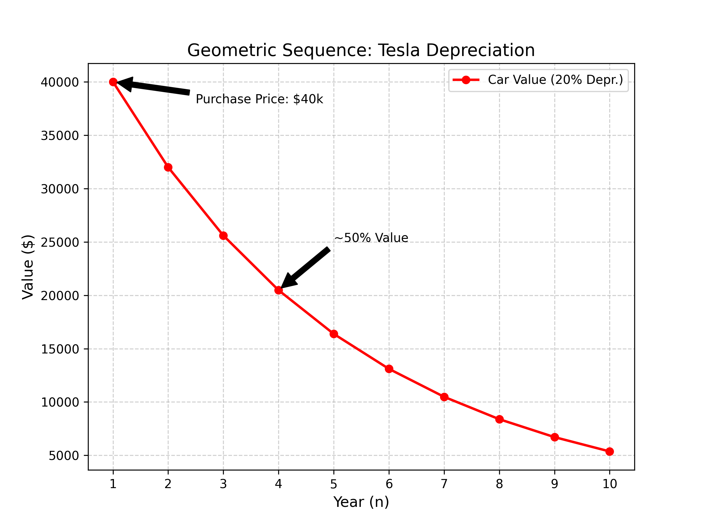

# Geometric Sequence

## Scenario

I bought a Tesla Model Y for \$40,000 and I'm tracking how its value drops over time. It loses 20% of its value each year.

## Data

Purchase Price ($a$): $\$40,000$

Depreciation Rate: $20\%$ per year

Value Retained: $80\%$ per year ($r = 0.8$)

Year 1: $\$40,000.00$ | Year 2: $\$32,000.00$

Year 3: $\$25,600.00$ | Year 4: $\$20,480.00$

Year 5: $\$16,384.00$ | Year 6: $\$13,107.20$

Year 7: $\$10,485.76$ | Year 8: $\$8,388.61$

Year 9: $\$6,710.89$ | Year 10: $\$5,368.71$

## Table

| Year ($n$) | Calculation $ar^{n-1}$ | Car Value ($a_n$) |
|------------|------------------------|-------------------|
| $1$        | $40000 \cdot (0.8)^0$  | \$40,000.00       |
| $2$        | $40000 \cdot (0.8)^1$  | \$32,000.00       |
| $3$        | $40000 \cdot (0.8)^2$  | \$25,600.00       |
| $4$        | $40000 \cdot (0.8)^3$  | \$20,480.00       |
| $5$        | $40000 \cdot (0.8)^4$  | \$16,384.00       |
| $6$        | $40000 \cdot (0.8)^5$  | \$13,107.20       |
| $7$        | $40000 \cdot (0.8)^6$  | \$10,485.76       |
| $8$        | $40000 \cdot (0.8)^7$  | \$8,388.61        |
| $9$        | $40000 \cdot (0.8)^8$  | \$6,710.89        |
| $10$       | $40000 \cdot (0.8)^9$  | \$5,368.71        |

## Calculations

**First Term:** $a = 40,000$

**Common Ratio:** $r = 1 - 0.20 = 0.8$

**Nth-Term Formula:**
$$a_n = ar^{n-1}$$
$$a_n = 40,000(0.8)^{n-1}$$

**Sum Formula:** (for $r \neq 1$)
$$S_n = a\frac{r^n - 1}{r - 1}$$
$$S_n = 200,000(1 - 0.8^n)$$

**Value in Year 7:**
$$a_{7} = 40,000(0.8)^{6} \approx 10,485.76$$

My car would be worth about \$10,486 in year 7.

## Graph

The graph curves downward—it drops fast at first then levels off. This is exponential decay.

## Explanation

This is a Geometric Sequence because I'm multiplying by 0.8 each year instead of adding a fixed amount.

- $a = 40,000$ → what I paid
- $r = 0.8$ → keeps 80% of value each year
- $a_n$ → car's value at any year $n$