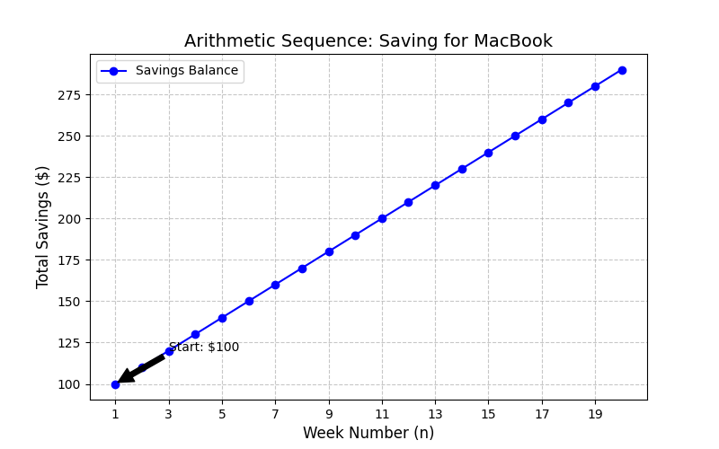

# Exploring Arithmetic and Geometric Sequences Through Real-Life Patterns

**Author:** Abdur-Rahman Bilal

---

## Aim

To explore and compare Arithmetic Progressions (A.P.) and Geometric Progressions (G.P.) using real-life scenarios, demonstrating how these mathematical sequences apply to everyday situations like savings and depreciation.

---

## Introduction to Sequences

A **sequence** is an ordered list of numbers that follow a specific pattern.

### Arithmetic Progression (A.P.)

In an arithmetic sequence, each term is obtained by **adding** a constant value called the **common difference** ($d$) to the previous term.

$$a_n = a + (n-1)d$$

Where:
- $a$ = first term
- $d$ = common difference
- $n$ = term number

### Geometric Progression (G.P.)

In a geometric sequence, each term is obtained by **multiplying** the previous term by a constant value called the **common ratio** ($r$).

$$a_n = ar^{n-1}$$

Where:
- $a$ = first term
- $r$ = common ratio
- $n$ = term number

---

## Arithmetic Sequence

### Scenario

I want to buy a MacBook Pro that costs \$2,063. I'm starting with \$100 in savings and adding \$10 every week.

### Data

Start Amount ($a$): $\$100$ 

Weekly Savings ($d$): $\$10$ 

Week 1: $\$100$  |  Week 2: $\$110$

Week 3: $\$120$  |  Week 4: $\$130$

Week 5: $\$140$  |  Week 6: $\$150$

Week 7: $\$160$  |  Week 8: $\$170$

Week 9: $\$180$  |  Week 10: $\$190$

### Table

| Week ($n$) | Calculation $a+(n-1)d$ | Total Balance ($a_n$) |
|------------|------------------------|----------------------|
| $1$        | $100+0(10)$            | $\$100$              |
| $2$        | $100+1(10)$            | $\$110$              |
| $3$        | $100+2(10)$            | $\$120$              |
| $4$        | $100+3(10)$            | $\$130$              |
| $5$        | $100+4(10)$            | $\$140$              |
| $6$        | $100+5(10)$            | $\$150$              |
| $7$        | $100+6(10)$            | $\$160$              |
| $8$        | $100+7(10)$            | $\$170$              |
| $9$        | $100+8(10)$            | $\$180$              |
| $10$       | $100+9(10)$            | $\$190$              |

### Calculations

**First Term:** $a = 100$

**Common Difference:** $d = 10$

**Nth-Term Formula:**
$$a_n = a + (n-1)d$$
$$a_n = 10n + 90$$

**Sum Formula:**
$$S_n = \frac{n}{2}[2a + (n-1)d]$$
$$S_n = 5n^2 + 95n$$

**Amount in Week 10:**
$$a_{10} = 100 + (10-1)10 = 190$$

So I'd have \$190 by week 10.

**Predicting When I Reach \$2,063:**
$$2063 = 100 + (n-1)10$$
$$n = 197.3$$

I'll need about 198 weeks to afford the MacBook.

### Graph

### Explanation

This is an Arithmetic Sequence because I'm adding the same amount (\$10) every week instead of multiplying by a percentage.

- $a = 100$ → my starting savings
- $d = 10$ → what I add each week
- $a_n$ → my balance at any week $n$

---

## Geometric Sequence

### Scenario

I bought a Tesla Model Y for \$40,000 and I'm tracking how its value drops over time. It loses 20% of its value each year.

### Data

Purchase Price ($a$): $\$40,000$

Depreciation Rate: $20\%$ per year

Value Retained: $80\%$ per year ($r = 0.8$)

Year 1: $\$40,000.00$ | Year 2: $\$32,000.00$

Year 3: $\$25,600.00$ | Year 4: $\$20,480.00$

Year 5: $\$16,384.00$ | Year 6: $\$13,107.20$

Year 7: $\$10,485.76$ | Year 8: $\$8,388.61$

Year 9: $\$6,710.89$ | Year 10: $\$5,368.71$

### Table

| Year ($n$) | Calculation $ar^{n-1}$ | Car Value ($a_n$) |
|------------|------------------------|-------------------|
| $1$        | $40000 \cdot (0.8)^0$  | \$40,000.00       |
| $2$        | $40000 \cdot (0.8)^1$  | \$32,000.00       |
| $3$        | $40000 \cdot (0.8)^2$  | \$25,600.00       |
| $4$        | $40000 \cdot (0.8)^3$  | \$20,480.00       |
| $5$        | $40000 \cdot (0.8)^4$  | \$16,384.00       |
| $6$        | $40000 \cdot (0.8)^5$  | \$13,107.20       |
| $7$        | $40000 \cdot (0.8)^6$  | \$10,485.76       |
| $8$        | $40000 \cdot (0.8)^7$  | \$8,388.61        |
| $9$        | $40000 \cdot (0.8)^8$  | \$6,710.89        |
| $10$       | $40000 \cdot (0.8)^9$  | \$5,368.71        |

### Calculations

**First Term:** $a = 40,000$

**Common Ratio:** $r = 1 - 0.20 = 0.8$

**Nth-Term Formula:**
$$a_n = ar^{n-1}$$
$$a_n = 40,000(0.8)^{n-1}$$

**Sum Formula:** (for $r \neq 1$)
$$S_n = a\frac{r^n - 1}{r - 1}$$
$$S_n = 200,000(1 - 0.8^n)$$

**Value in Year 7:**
$$a_{7} = 40,000(0.8)^{6} \approx 10,485.76$$

My car would be worth about \$10,486 in year 7.

### Graph

### Explanation

This is a Geometric Sequence because I'm multiplying by 0.8 each year instead of adding a fixed amount.

- $a = 40,000$ → what I paid
- $r = 0.8$ → keeps 80% of value each year
- $a_n$ → car's value at any year $n$

---

## Comparison of A.P. & G.P.

| Feature | Arithmetic Progression | Geometric Progression |
|---------|------------------------|----------------------|
| **Pattern** | Add constant $d$ | Multiply by constant $r$ |
| **Formula** | $a_n = a + (n-1)d$ | $a_n = ar^{n-1}$ |
| **Graph** | Straight line | Curved (exponential) |
| **Growth** | Linear | Exponential |
| **My Example** | Weekly savings (+\$10) | Car depreciation (×0.8) |

### Key Differences

**Arithmetic:** The difference between consecutive terms is constant.
$$a_2 - a_1 = a_3 - a_2 = d$$

**Geometric:** The ratio between consecutive terms is constant.
$$\frac{a_2}{a_1} = \frac{a_3}{a_2} = r$$

---

## Conclusion

Through this project, I explored two types of sequences using real-life examples:

1. **Arithmetic Progression** - My savings plan where I add \$10 weekly. The graph shows a straight line because the growth is constant.

2. **Geometric Progression** - My car's depreciation where the value drops by 20% yearly. The graph shows a curve because the change is proportional.

Both sequences have practical applications. A.P. helps predict savings over time, while G.P. models things like depreciation, population growth, and compound interest.

---

## Credits

### Tools Used

- **MyST Markdown** - for writing and formatting this document as a PDF book
- **KaTeX** - for rendering math equations
- **Markdown** - for text formatting and tables
- **Matplotlib** - for creating the graphs in Python

### AI Assistance

I used AI to help with:
- Generating the Python code for the Matplotlib graphs
- Formatting the document in MyST Markdown for PDF book output
